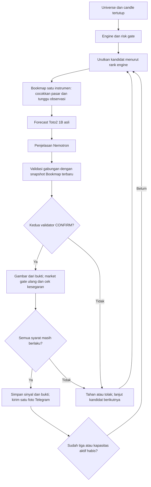

# Toto2 1B + Bookmap sebagai validator terakhir

Tanggal: 7 Oktober 2026. Status: rancangan tertulis untuk ditinjau, belum diimplementasikan atau diaktifkan.

## Tujuan dan batas pengguna

Upgrade `crypto-signal-bot` harus mengirim analisis bergambar ke Telegram hanya setelah kandidat lulus Toto 2.0 1B dan pemeriksaan data Bookmap. Maksimal tiga koin berbeda boleh diterbitkan untuk satu candle pemicu 15 menit. Satu atau nol hasil tetap sah. Bookmap Digital gratis hanya mendukung satu instrumen aktif sekaligus; pemeriksaan dilakukan bergantian.

Entry, SL, TP, arah, spread, funding, biaya, batas usia kandidat, dan batas sinyal aktif tetap berasal dari engine deterministik. Toto2 dan Bookmap hanya dapat menahan atau menolak kandidat. Nemotron memberikan penjelasan. Semua hasil tetap PAPER/SIMULASI.

Asumsi pasar: Binance USD-M Futures, kontrak perpetual USDT, sesuai universe bot saat ini. Jenis koneksi Bookmap pengguna belum terkonfirmasi. Binance Spot, perpetual lain, atau data tertunda tidak boleh dianggap sebagai bukti untuk pasar tersebut.

## Keadaan proyek saat diperiksa

Dasar rancangan adalah checkout upgrade `C:/Users/Yudistira/crypto-v2-readiness`, commit `cdc584eb8264269bad7a27074afc7afd0b73d728`. Folder asli pengguna dipertahankan.

- `bot.py` mengurutkan kandidat berdasarkan `rank` engine dan menerbitkan sinyal dalam loop. Pemeriksaan Toto saat ini berada dalam bukti penjelasan dan belum menjadi syarat penerbitan.
- `v2/toto.py` mempunyai kontrak identitas model dan worker, tetapi belum mempunyai implementasi Toto2 1B. Jalur lama bergantung pada forecast PatchTST; adapter palsunya hanya untuk pengujian.
- `v2/ranking.py` mempunyai pemilihan tiga kandidat, tetapi belum dipanggil oleh scan. Gerbang opsionalnya belum cukup untuk mewajibkan dua validator baru.
- `services.py` menyimpan candle dan sinyal, serta mengirim teks Telegram dengan pencatatan sebelum panggilan jaringan.
- `v2/resource_gate.py` belum mendukung pengukuran sumber daya Windows.
- Perangkat yang terbaca: sekitar 16 GiB RAM, RTX 5050 Laptop dengan 8151 MiB VRAM. Lingkungan ML verifikasi sekarang memakai Torch CPU; inferensi CUDA Toto2 belum diuji.

## Pilihan pendekatan

| Pendekatan | Dampak | Keputusan |
| --- | --- | --- |
| Python API Bookmap membaca depth dan trades pada instrumen yang dibuka pengguna | Menggunakan feed Bookmap nyata dan cukup untuk validasi otomatis; pergantian instrumen manual | Tahap pertama yang dipilih |
| Pengendali langganan instrumen lewat API resmi | Dapat memungkinkan pergantian otomatis, tetapi dukungan dan perilaku paket gratis harus dibuktikan | Ditunda sampai ada bukti akses dan uji satu instrumen |
| Feed Binance langsung untuk menggambar profil likuiditas | Berguna sebagai visual mandiri, tetapi tidak membuktikan integrasi Bookmap | Tidak dipakai sebagai pengganti validator Bookmap |

Dokumentasi Python API menjelaskan callback untuk instrumen yang diaktifkan dan langganan depth/trades pada alias tersebut. Dokumentasi yang diperiksa belum membuktikan pergantian instrumen otomatis atau akses add-on pada akun pengguna. Tahap pertama tidak mengasumsikan kedua kemampuan itu tersedia. Bila add-on tidak dapat berjalan, status integrasi adalah UNAVAILABLE dan penerbitan dalam mode wajib ditahan.

## Alur dan arti tiga koin terbaik

"Terbaik" berarti urutan `rank` engine yang sudah ada, dengan simbol sebagai pemutus seri deterministik. Ambil paling banyak tiga konfirmasi dalam urutan tersebut. Confidence model tidak dipakai untuk mengubah urutan sesudah hasil sebelumnya dikirim. Tidak diperlukan pemeriksaan seluruh pool lalu menunggu semua bukti menjadi basi.

Loop scan yang ada dipertahankan; tidak ditambah broker antrean atau layanan penjadwal baru. Log lokal dan `report` menunjukkan koin berikutnya yang perlu dibuka di Bookmap. Pengguna menutup instrumen lama lalu membuka instrumen berikutnya. Bot menunggu paling lama 90 detik per kandidat, termasuk minimal 60 detik observasi setelah instrumen aktif. Setelah itu kandidat yang belum siap menjadi HOLD untuk scan tersebut.

Seluruh pekerjaan dibatasi tenggat engine: tidak ada penerbitan lebih dari 10 menit setelah candle pemicu ditutup. Tunggu Bookmap dan timeout worker selalu dibatasi sisa tenggat. Kandidat berikutnya dilewati ketika waktu tidak cukup; batas ini tidak diperpanjang untuk memenuhi kuota tiga.

Batas tiga dihitung dari sinyal yang sudah tersimpan untuk candle pemicu, termasuk saat proses diulang atau dihentikan lalu dimulai kembali. Simbol tidak boleh terduplikasi. Kapasitas tambahan adalah `min(3 - sudah_terbit_pada_candle, MAX_OPEN_SIGNALS - sinyal_aktif)`. Sinyal aktif pada koin yang sama tetap menghalangi kandidat. Kegagalan Telegram tidak mengosongkan slot.

## Bukti Toto2

Model wajib adalah `Datadog/Toto-2.0-1B`, dengan revision penuh dan hash file bobot dalam manifest lokal. Revision yang diperiksa: `1604e1a5242884fb9848f88c4ced14f4dc62d9d3`. Pengunduhan dan pemuatan memakai revision tersebut, bukan `main` atau `latest`. Worker dan penerima memeriksa identitas terhadap manifest yang benar-benar dipasang; identitas dari respons saja tidak cukup.

Paket resminya `toto-2`, modul Python `toto2`. Metadata sumber versi 2.0.0 yang diperiksa mensyaratkan Python 3.12+ dan Torch 2.14+, lebih ketat daripada ringkasan README. Dependensi model ditempatkan dalam lingkungan ML terpisah dari bot.

Input awal paling sederhana adalah 512 close candle 1 menit yang sudah tertutup dari pasar Binance Futures yang sama. Gunakan pengambil dan validator candle yang sudah ada. Bar harus berurutan tanpa duplikasi, gap, waktu masa depan, atau angka non-finite. Tidak diperlukan training PatchTST untuk menjalankan validator ini.

Forecast memprediksi 15 langkah satu menit. Simpan sembilan quantile asli, horizon, simbol, waktu akhir input, hash input, waktu selesai inferensi, dan identitas model. Quantile harus positif, finite, dan berurutan. Data input tidak boleh lebih tua dari 180 detik saat penerbitan; input baru memerlukan inferensi baru.

Aturan awal yang transparan, belum diklaim terkalibrasi untuk crypto:

- LONG hanya CONFIRM jika quantile 0.2 pada langkah ke-15 berada di atas close terakhir setelah estimasi biaya pulang-pergi `2 * (fee_bps + slippage_bps)`.
- SHORT hanya CONFIRM jika quantile 0.8 berada di bawah close terakhir setelah estimasi biaya yang sama.
- Median yang berlawanan dengan arah engine menghasilkan REJECT. Arah yang belum cukup kuat menghasilkan HOLD.

Quantile bukan probabilitas menang atau jaminan TP. Forecast ini memeriksa arah jangka pendek; hasil PAPER tetap mengevaluasi entry/SL/TP engine. Tidak diisi `p_up` palsu agar sesuai kontrak lama. Bukti Toto2 diberi kontrak baru yang memuat quantile dan dapat divalidasi ketat; kontrak/adaptor Toto lama tetap dapat dipakai untuk pengujian jalur lamanya.

Worker satu permintaan per proses memakai mekanisme subprocess yang sudah ada, timeout maksimal 120 detik dan tidak melebihi tenggat kandidat. Pemuatan ulang bobot diterima untuk maksimum tiga penerbitan per scan; worker yang menetap baru diperlukan jika pengukuran menunjukkan pemuatan mendominasi waktu. Semua pekerjaan model diserialkan.

Target awal inferensi adalah CUDA di Windows. Dukungan pengukuran Windows ditambahkan pada gerbang sumber daya yang ada dengan API sistem untuk RAM dan utilisasi CPU. Pemeriksaan GPU di worker menggunakan Torch. Ambang awal yang dapat diatur: CPU maksimum 85%, RAM bebas minimal 6 GiB, VRAM bebas minimal 6 GiB sebelum model dimuat. Telemetri gagal, resource pressure, CUDA tidak tersedia, OOM, timeout, atau model tidak lengkap menghasilkan UNAVAILABLE/HOLD. Ukuran model dan latency pada A100 tidak dianggap sebagai hasil pengukuran laptop ini.

## Bukti Bookmap

Add-on Python membaca callback depth dan trades untuk tepat satu alias aktif. Ia menyimpan snapshot lokal secara atomik; file berisi versi schema, sesi, generasi langganan, alias, simbol, venue, jenis produk, skala harga/ukuran, waktu penerimaan, status koneksi, BBO, depth, serta agregat trades 60 detik. State sementara berada dalam `runtime/`, tidak masuk Git.

Harga integer dikonversi dengan `pips`; ukuran dibagi `size_multiplier`, sesuai API. Snapshot yang tidak lengkap tidak boleh ditandai siap. Readiness mensyaratkan acknowledgement langganan, depth valid pada kedua sisi, minimal 10 level yang teramati per sisi, serta 60 detik observasi kontinu dari sesi yang sama. Provider/alias dipetakan secara eksplisit dan diperiksa terhadap simbol serta produk Binance USD-M Futures; tidak ditebak hanya dari nama coin.

Saat unsubscribe, disconnect, atau pergantian instrumen, state lama segera dibatalkan dan buffer trades dibersihkan. Mengganti kembali ke koin sebelumnya membuat generasi baru dan memulai observasi dari awal. Snapshot koin lain tidak boleh digunakan untuk kandidat yang sedang diperiksa.

Pemeriksaan terakhir memerlukan depth diterima dalam 5 detik terakhir, trade terbaru dalam 15 detik terakhir, tidak ada error feed yang diketahui, dan BBO yang konsisten dengan quote Binance baru dalam toleransi `MAX_SPREAD_BPS`. Waktu penerimaan lokal dilabeli sebagai waktu penerimaan, bukan timestamp exchange yang tidak disediakan callback. Selisih jam yang tidak dapat diperiksa membuat bukti tidak tersedia.

Aturan Bookmap awal menghitung imbalance dari 10 level harga terdekat yang teramati per sisi dan `(buy_volume - sell_volume) / total_volume` selama 60 detik. Keduanya harus searah kandidat dan melampaui `MIN_TAKER_IMBALANCE` yang sudah dikonfigurasi. Imbalance lawan arah menghasilkan REJECT; kondisi netral atau denominator nol menghasilkan HOLD. Ini rule bot atas data Bookmap, bukan klaim bahwa aplikasi Bookmap mengeluarkan keputusan trading sendiri.

Kemampuan add-on dan koneksi paket pengguna menjadi syarat uji integrasi nyata. Pengujian dengan rekaman sintetis hanya membuktikan parser/rule; tidak membuktikan koneksi Bookmap hidup. Tanpa koneksi nyata tidak boleh ada label "Bookmap tervalidasi".

## Gerbang terakhir dan mode

Tambahkan satu konfigurasi eksplisit untuk validator gabungan: `FINAL_VALIDATOR_MODE=off|shadow|required`, default `required` agar instalasi upgrade tidak diam-diam melewati validator. `off` hanya mencatat analisis engine secara lokal tanpa menjalankan validator gabungan. `shadow` mencatat dua hasil untuk pengujian. Kedua mode tersebut tidak menerbitkan sinyal baru dan tidak mengirim analisis kandidat ke Telegram, sekalipun `TELEGRAM_ENABLED=true`. Evaluasi sinyal lama tetap berjalan. Konfigurasi mode yang tidak valid menghentikan scan.

Mode yang memenuhi permintaan pengguna adalah `required`. Mode ini hanya menerbitkan bila kedua bukti nyata berstatus OK/CONFIRM, cocok dengan kandidat, model yang dipasang, pasar, horizon, dan batas kesegaran. Salah satu bukti hilang, HOLD, REJECT, palsu, atau basi menahan penerbitan. Mode wajib tidak menghasilkan sinyal sampai model dan Bookmap siap; menjalankan layanan dengan konfigurasi Telegram nyata dilakukan setelah uji model dan Bookmap nyata lolos.

`V2_MODE` untuk bukti lama tidak boleh mengendurkan mode wajib. PatchTST tetap bukti tambahan; Nemotron tetap penjelasan. Pada mode wajib, provider penjelasan hanya `nemotron` atau `mock` untuk pengujian; konfigurasi veto legacy Ollama/Hermes ditolak. Jalur final tidak memanggil inferensi dua kali melalui `reasoning.evidence`; bukti yang sudah dihitung diteruskan untuk penjelasan.

Sesudah penjelasan, ambil snapshot Bookmap terbaru dan lakukan pemeriksaan gabungan. Buat gambar dari snapshot yang lolos tersebut. Sesudah rendering, ambil quote/funding terbaru, jalankan `validate_market`, serta periksa lagi usia bukti dan status sesi Bookmap sebelum menyimpan sinyal. Snapshot yang dipakai harus tetap berumur maksimal 5 detik; jika terlalu lama, kandidat ditahan. Feed yang terus bergerak tidak harus mempunyai hash snapshot terbaru yang sama: hash pada gambar dan payload mengacu ke snapshot keputusan yang sama, sedangkan sesi aktif harus tetap sama. Tidak ada perubahan numerik engine oleh kedua validator.

## Gambar dan pengiriman Telegram

Satu foto PNG per sinyal memuat 48 candle 15 menit tertutup sampai candle pemicu, garis entry/SL/TP engine, ringkasan quantile Toto2 untuk horizon 15 menit, dan profil bid/ask dari snapshot Bookmap yang diperiksa. Profil likuiditas diberi waktu dan sumber; tidak dilabeli sebagai screenshot layar Bookmap atau heatmap historis. Renderer plotting deterministik dijalankan sebagai subprocess di lingkungan ML yang sama, tempat Matplotlib menjadi dependensi paket Toto2. Bot tidak mengimpor Matplotlib dari venv utamanya; proses render tidak perlu memuat bobot Toto2. Tidak digunakan layanan pembuat gambar AI.

Gambar dibuat lokal terlebih dahulu dengan label simbol, pasar, timeframe, waktu UTC, dan PAPER/SIMULASI. Caption `sendPhoto` dibatasi 1024 karakter, selalu mempertahankan ID, arah, entry, SL, TP, masa berlaku, status kedua validator, serta label PAPER. Ringkasan penjelasan saja yang dipendekkan; penjelasan lengkap tetap disimpan dalam payload. Ukuran PNG dibatasi di bawah batas unggahan API.

Kesalahan pembuatan gambar dicatat sebagai kegagalan persiapan pengiriman dan membatalkan penerbitan calon tersebut. Keputusan engine dan bukti validator tidak ditulis ulang sebagai keputusan model yang berbeda.

Pertahankan pencatatan UNKNOWN sebelum panggilan jaringan dan tanpa retry otomatis pada hasil ambigu. HTTP berhasil dengan respons valid menyimpan SENT dan message ID; penolakan pasti menyimpan REJECTED. Exception pengiriman sesudah sinyal tersimpan tidak boleh mengubah analisis menjadi HOLD atau menerbitkan kandidat pengganti untuk mengisi slot yang sama. Tidak ditambah pesan teks kedua yang menciptakan status pengiriman parsial.

## Ruang perubahan minimum

- `bot.py`: panggil validator gabungan pada loop kandidat, enforce batas tiga per candle, tunggu instrumen secara terbatas, dan pertahankan pemeriksaan market terakhir.
- `v2/toto.py`, `v2/contracts.py`, dan worker Toto2: inferensi kandidat tanpa keharusan forecast PatchTST, identitas bobot nyata, serta schema quantile.
- Jembatan/add-on Bookmap kecil: tangkap satu feed, reset sesi, simpan snapshot, dan lakukan rule validasi. Tidak perlu framework adapter atau server publik.
- `v2/resource_gate.py`: dukungan sumber daya Windows yang diperlukan untuk worker lokal.
- `reasoning.py`: gunakan bukti yang sudah dihitung tanpa inferensi duplikat dan pertahankan peran penjelasan.
- `services.py` dan renderer: gambar berbasis candle tersimpan, satu `sendPhoto`, dan status pengiriman yang terpisah dari kelulusan.
- Konfigurasi contoh, doctor, dan dokumentasi: tampilkan kesiapan model, koneksi, mode, serta petunjuk pergantian koin. Credential tetap lokal.

Tidak ada migrasi QuantConnect, eksekusi order exchange, upgrade paket Bookmap berbayar, pembukaan tiga instrumen sekaligus, atau perubahan folder asli pengguna dalam pekerjaan ini.

## Bukti penerimaan sebelum dinyatakan selesai

1. Satu kandidat nyata hanya lolos jika engine, Toto2 1B yang dipin, Bookmap hidup pada pasar yang sama, serta final market check semuanya lolos.
2. Data hilang/basi/salah simbol/salah pasar, pergantian sesi, identity palsu, CUDA/OOM/timeout, dan config invalid gagal secara tertutup dalam mode wajib.
   Mode `off` dan `shadow` tidak boleh menerbitkan atau mengirim sinyal baru walaupun Telegram dikonfigurasi aktif.
3. Kandidat diproses satu instrumen sekaligus; penolakan pertama memungkinkan kandidat berikutnya. Tidak ada persetujuan yang menggunakan buffer dari koin sebelumnya.
4. Empat kandidat yang memenuhi syarat menghasilkan maksimal tiga simbol berbeda; sinyal aktif dan pengulangan candle tidak melampaui batas.
5. Entry/SL/TP pada PNG, caption, dan payload sama dengan engine; candle gambar tidak mencakup data masa depan; caption tidak melampaui batas API.
6. Kegagalan Telegram mempertahankan persetujuan dan penggunaan slot, UNKNOWN tidak diulang otomatis, serta renderer gagal tidak menghasilkan foto/angka buatan.
7. Uji inferensi Toto2 nyata pada laptop mencatat revision/hash, latency, peak RAM/VRAM, dan hasil numerik. Uji Bookmap nyata membuktikan callback dan reset untuk setidaknya dua koin secara bergantian pada paket pengguna.
8. Uji pengiriman memakai HTTP stub sampai pengguna mengizinkan pesan uji nyata. Aktivasi bot berjalan terpisah dari penyiapan dan verifikasi kode.

## Sumber primer yang diperiksa

- [Bookmap: batas instrumen dan paket](https://bookmap.com/en/packages-comparison).
- [Bookmap: Python API dan batas provider](https://bookmap.com/knowledgebase/docs/Addons-Python-API).
- [BookmapAPI: callback, depth/trades, dan skala harga/ukuran](https://github.com/BookmapAPI/python-api).
- [Datadog: Toto2 README dan bentuk quantile](https://github.com/DataDog/toto/blob/main/toto2/README.md).
- [Datadog: metadata paket Toto2](https://github.com/DataDog/toto/blob/main/toto2/pyproject.toml).
- [Datadog: model Toto2 1B dan benchmark A100](https://huggingface.co/Datadog/Toto-2.0-1B).
- [Datadog: revision model yang diperiksa](https://huggingface.co/Datadog/Toto-2.0-1B/commit/1604e1a5242884fb9848f88c4ced14f4dc62d9d3).
- [Telegram: sendPhoto](https://core.telegram.org/bots/api#sendphoto).
